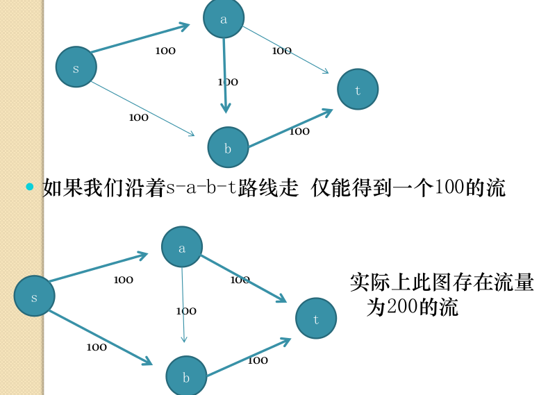
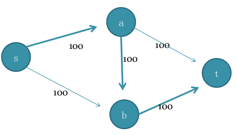
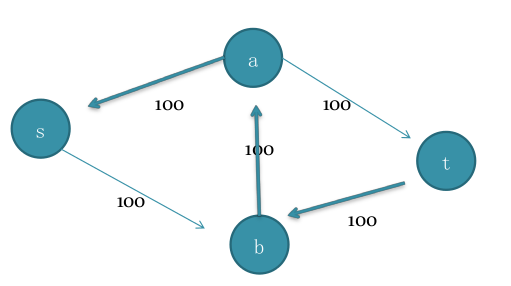
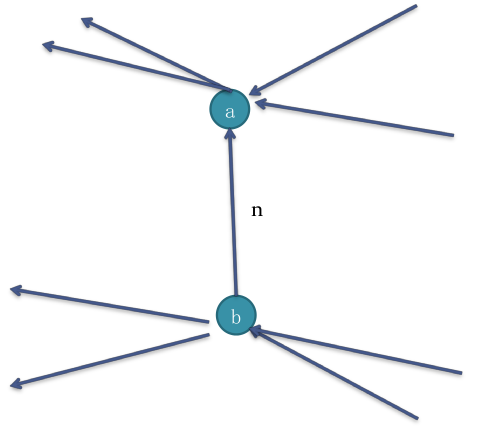
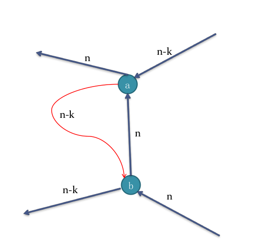
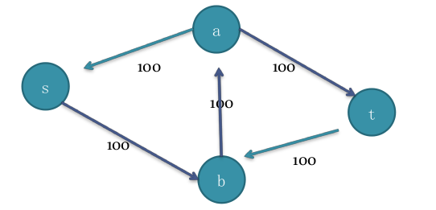
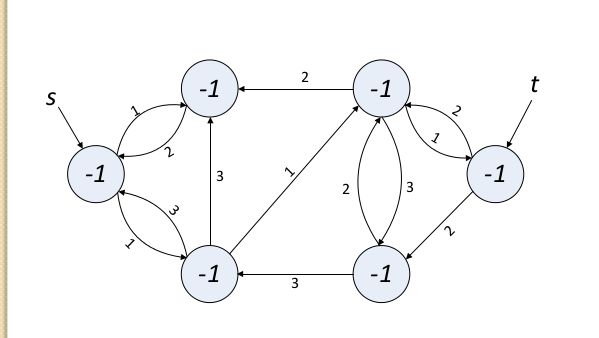
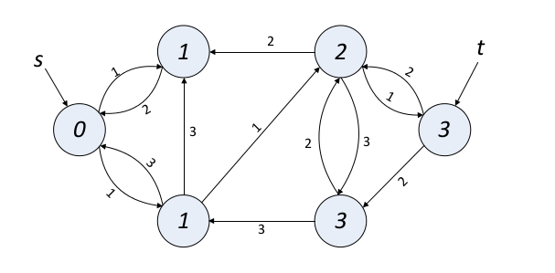

关于网络流的学习
===

应该属于图论的部分，但是单独拿出来作为了一个分类。对于模板而言有些过于详细

什么是网络流?
===
- 外文名：Network-flows
- 使用领域范围：统筹学中的最优化问题
- 具体：
   一个给定的网络上寻求两点间最大运输量的问题。也可以想成最大流量的问题。
- 实例:
    给定一个有向图G=(V, E), 把图中的边看做管道，每条边上有一个权值，表示该
    管道的流量上限。给定源点s和汇点t，现在假设在s处有一个水源，t处有一个蓄水池，
    问从s到t的最大水流量是多少。
    
- 定理

1. 网络流图中，源点流出的量，等于汇点流入的量，除汇点外的任何点，其流入量之和等于
    流出量之和。

算法
===

解决最大流的Ford-Fulkerson算法 
---

- **基本思路**:
    1. 每次用DFS从源到汇找一条可行路径，然后把这条路塞满。这条路径上容量最小的
    那条边的容量，就是这次DFS所找到的流量。
    2. 然后对于路径上的每条边，其容量要减去刚才找到的流量 。
    这样，每次DFS都可能增大流量，直到某次dfs找不到可行路径为止，最大流就求出来了。
- **这么想是否正确？**
    - 问题在：过早的认为`a -> b`上的流量不为0, 因而封锁了流量继续增大的可能。
    
    - 改进的思路：应该能修改已经建立的流网络，使得"不合理"的流量被删除。
    - **一种实现：**
        1. 对上次DFS时找到的流量路径上的边，添加一条"反向"边， 反向边上的容量
        等于上次DFS时找到的该边上的流量，再利用"反向"的容量和其他边上剩余的容
        量寻找路径。
            1. 第一次DFS: 
            
            2. 第二次DFS: 
              
          （这样做的好处是什么？为什么这么做？）
        2. **为什么添加反向边（取消流）的操作是有效的？**
            1. 假设在第一次寻找流的时候，发现在`b->a`上可以有流量来自源，到达b，再流
                出a后抵达汇点。
                - 
            2. 构建残余网络时添加`a->b`，容量是n，增广的时候发现了流量n-k，即新增了
                n-k的流量。这n-k的流量，a进b出，最终留到汇  
                - 
            4. 现在要证明2n-k的流量，在原图上确实是可以从源流到汇的。
            5. 把流入b的边合并，看做一条，把流出a的边也合并，同理把流入a的和流出b
                的边也合并
                - 
            6. 再合并
                - 
            7. 这是一个感性的认识, 并非严格证明。 
        2. 答：**反向边的存在使得该流量没有被删除掉**
        这样我们第二次DFS搜索的时候就可以在新的网络里找到新的路径。
        这是一个**取消流**的操作，也可以看作是两条路径的合并。
          
        - 两次搜索分别找到流量为100的流，加上第一次搜索得到的流量为100的流，总流量
        上升到200.  
        - (因为反向边的存在，抵消了两次的互相灌输）
        
概念
---

- **残余网络**
    在一个网络流图上，找到一条源到汇的路径（即找到了一个流量）后，对路径上所有的
    边，其容量都减去此次找到的流量，对路径上所有的边，都添加一条反向边，这样得到
    的新图，就称为原图的"残留网络"。

- **增广路径**
    每次寻找新流量并构造新残余网络的过程，就叫做寻找流量的"增广路径"， 也叫增广。
    特别的，增广过后的图，就是残余网络。

复杂度分析
---

- **现在假设:**
    每条边的容量都是整数，这个算法每次都能将流至少增加1。
    由于整个网络的流量最多不超过图中所有的边的容量和C，从而算法会结束。
- **看复杂度:**
    增广路径算法可以用DFS，复杂度为边数*m*+顶点数*n*
    DFS最多运行C次
    所以时间复杂度为$C*(m+n)=C*n^2$
- **结论**
    这个算法实现很简单，但是注意到在图中，C可能Huge。
    比如说下图：
    - 
    如果运气不好，这种图会让程序跑200次DFS——虽然实际上最少只要两次我们就能
    得到最大流。
- **那么问题就来了：**
    - 学××哪家强？
    - 如何避免上述情况发生？
        在每次增广的时候，选择从源到汇的具有最少边数的增广路径，即不是通过
        DFS寻找增广路径，而是通过BFS寻找增广路径。
        这就是著名的**Edmonds-Karp**最短增广路算法。
    - 已经证明这种算法的复杂度上限为$nm^2$(n是点数，m是边数)
    - 相对另一个复杂度为`$C\*n^2$`
- 测试题目[poj1273](../../POJ/poj1273.cpp)

---

Dinic 快速网络流算法
---

前面的网络流算法，每进行一次增广，都要做一遍BFS，十分浪费。能否少做几次BFS？

这就是Dinic算法要解决的问题

- Edmonds-Karp的提高余地在于：
    需要多次从s到t调用BFS，可以设法减少调用次数。
- __亦即__：使用一种代价较小的高效的增广算法（万变不离其宗）
- __考虑__：在一次增广的过程中，寻找多条增广路径
- DFS

具体实现
---

1. **首先利用 BFS 对残余网络分层**
    - 
    - 
    - 一个节点的"层"数，就是源点到它最少要经过的**边数**。
2. **分层结束后，利用DFS从前一层往后一层反复寻找增广路。**
    即：要求DFS每一步都必须要走到下一层的节点。
    - 因此，前面在分层时，只要进行到汇点的层次数被算出即可停止，因为按照
        DFS的规则，和汇点同层或下一层的节点，是不可能走到汇点的。
        (为什么？)
    - DFS过程中，要是碰到了汇点，则说明找到了一条增广路径。此时要增加总流
        量的值，消减路径上各边的容量，添加反向边，即所谓的进行增广。
    - DFS找到一条增广路径后，并不立即结束，而是回溯后继续寻找下一个增广
        路径。 回溯到哪一个节点呢?
        回溯到的节点u满足以下条件：
        1. DFS搜索树的树边(u, v)上的容量已经变成0。即刚刚找到的增广路径上
        所增加的容量，等于(u, v)本次增广前的容量（DFS的过程中，是从u走到更下层的v的）。
        2. u是满足条件1.的最上层的节点。
        如果回溯到源点且无法继续往下走了，DFS结束。
        因此，一次DFS的过程中，可以找到多条增广路径。
        DFS结束后，对残余网络再次分层，然后进行DFS。
        当残余网络的分层操作无法算出汇点的层次（即BFS到达不了汇点），算法结束，最大流求出。
        一般用栈实现DFS，这样就能从栈中取出增广路径。
3. **要求出最大流中每条边的流量，怎么办？**
    - 将原图备份，原图上的边的容量减去昨晚最大流的残余网络上的边的剩余容量，就
    是边的流量。

复杂度
---

- Dinic的复杂度是`$n*n*m$`(n是点数，m是边数)
    
题目：
---
- 测试题目
    - [poj1273](../../POJ/poj1273.cpp)
    - [poj3436](../../POJ/poj3436.cpp)
    - [poj2112](../../POJ/poj2112.cpp)
    - [poj1149](../../POJ/poj1149.cpp)

---

有流量下界的网络最大流
===

临时的想法
===

如果使用水流法来判断最大流——即模拟过程，利用端点蓄水量来判断水流流向。

利用动态规划，单位蓄水。需要BFS分层——是否就是第二个算法。

